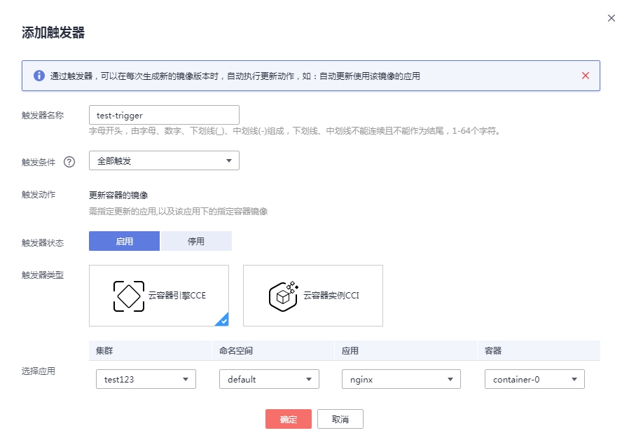

# 如何更新应用的镜像版本

“容器镜像服务“可搭配“云容器引擎“一起使用。每当有镜像版本更新时，可自动更新使用该镜像部署的应用。

您只需要为镜像设置一个触发器。通过触发器，可以在每次生成新的镜像版本时，自动执行更新动作，如自动更新使用该镜像的应用。

## 前提条件

更新应用镜像版本之前，请确保已创建容器应用，将镜像部署到云容器引擎。

如果还未创建，请登录云容器引擎创建应用页面进行创建，具体创建方法请参见[通过镜像创建无状态工作负载](http://support.huaweicloud.com/usermanual-cce/cce_01_0047.html)或[通过镜像创建有状态工作负载](http://support.huaweicloud.com/usermanual-cce/cce_01_0048.html)。

## 添加触发器

1.  登录容器镜像服务控制台。
2.  在左侧菜单栏选择“我的镜像“，单击右侧镜像名称，进入镜像详情页。
3.  选择“触发器“页签，单击，根据下表填写相关参数，然后单击“确定“。

    **表 1**  触发器

    
    <table><thead align="left"><tr id="row362424415719"><th class="cellrowborder" valign="top" width="16%" id="mcps1.2.3.1.1">
参数

    </th>
    <th class="cellrowborder" valign="top" width="84%" id="mcps1.2.3.1.2">
说明

    </th>
    </tr>
    </thead>
    <tbody><tr id="row126241344125712"><td class="cellrowborder" valign="top" width="16%" headers="mcps1.2.3.1.1 ">
触发器名称

    </td>
    <td class="cellrowborder" valign="top" width="84%" headers="mcps1.2.3.1.2 ">
字母开头，由字母、数字、下划线(_)、中划线(-)组成，下划线、中划线不能连续且不能作为结尾，1-64个字符。

    </td>
    </tr>
    <tr id="row1462434455710"><td class="cellrowborder" valign="top" width="16%" headers="mcps1.2.3.1.1 ">
触发条件

    </td>
    <td class="cellrowborder" valign="top" width="84%" headers="mcps1.2.3.1.2 ">
支持如下三种触发条件，当镜像有新版本时，触发部署应用。

    <ul id="ul1923411281905"><li>全部触发：有新的镜像版本生成或镜像版本发生更新时，触发部署。</li><li>指定版本号触发：有指定镜像版本生成或更新时，触发部署。</li><li>正则触发：有符合正则表达式的镜像版本生成或更新时，触发部署。</li></ul>
    
本例中选择全部触发，当有新的镜像版本生成时触发部署。

    </td>
    </tr>
    <tr id="row1362494415711"><td class="cellrowborder" valign="top" width="16%" headers="mcps1.2.3.1.1 ">
触发动作

    </td>
    <td class="cellrowborder" valign="top" width="84%" headers="mcps1.2.3.1.2 ">
当前仅支持更新容器的镜像，需指定更新的应用，以及该应用下的指定容器镜像。

    </td>
    </tr>
    <tr id="row2034315951713"><td class="cellrowborder" valign="top" width="16%" headers="mcps1.2.3.1.1 ">
触发器状态

    </td>
    <td class="cellrowborder" valign="top" width="84%" headers="mcps1.2.3.1.2 ">
选择“启用”。

    </td>
    </tr>
    <tr id="row1867154816580"><td class="cellrowborder" valign="top" width="16%" headers="mcps1.2.3.1.1 ">
选择应用

    </td>
    <td class="cellrowborder" valign="top" width="84%" headers="mcps1.2.3.1.2 ">
选择要更新镜像的容器。

    </td>
    </tr>
    </tbody>
    </table>

    **图 1**  添加触发器  
    

## 验证操作

1.  上传新的镜像版本至容器镜像服务的镜像仓库中。

    本例中触发器设置的触发条件为全部触发，即有新的镜像版本生成或镜像版本发生更新时，触发应用部署。此处上传新镜像版本至容器镜像服务中验证触发结果，其他情况的验证（例如，镜像版本更新）可参考[《容器镜像服务最佳实践》](https://support.huaweicloud.com/bestpractice-swr/swr_bestpractice_0001.html)。

2.  查看部署结果。

    此时构建任务将会自动构建镜像，构建完成后，可在镜像详情页查看到新建的镜像版本。

    **图 2**  查看新建镜像版本  
    

    镜像更新，进一步触发容器应用的更新。

    **图 3**  查看触发器状态  
    

    查看云容器引擎控制台中应用详情页，可以查看到应用实例正在创建。待实例创建完成，说明应用已更新完成。

    **图 4**  查看应用详情  
    

    切换至“访问方式“，单击访问链接IP，可以打开应用页面。可以看到已更新的应用信息。

