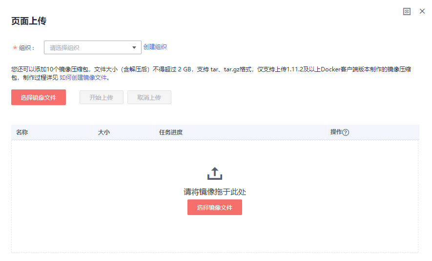

# 页面上传镜像

本章节介绍如何通过页面上传镜像。从页面上传镜像，是指直接通过页面将镜像上传到容器镜像服务。

> **须知：**   
>每次最多上传10个文件，单个文件大小（含解压后）不得超过2G，页面上传支持tar、tar.gz格式镜像文件。  

## 前提条件

-   已创建组织，请参见[创建组织](组织管理.md#section12921632181415)。
-   镜像已存为tar或tar.gz文件，具体请参见[制作镜像压缩包](Docker基础知识.md#section3433103111126)。
-   仅支持上传1.11.2及以上Docker客户端版本制作的镜像压缩包。

## 操作步骤

1.  登录容器镜像服务控制台。
2.  在左侧菜单栏选择“我的镜像“，单击右侧“页面上传“。
3.  在弹出的窗口中选择镜像要上传的组织，单击“选择镜像文件“，选择要上传的镜像文件。

    > **说明：**   
    >多个镜像同时上传时，镜像文件会按照顺序逐个上传，不支持并发上传。  

    **图 1**  上传镜像  
    

4.  在弹出的窗口中单击“开始上传“。

    待任务进度显示“上传完成“，表示镜像上传成功。

    **图 2**  上传完成  
    

